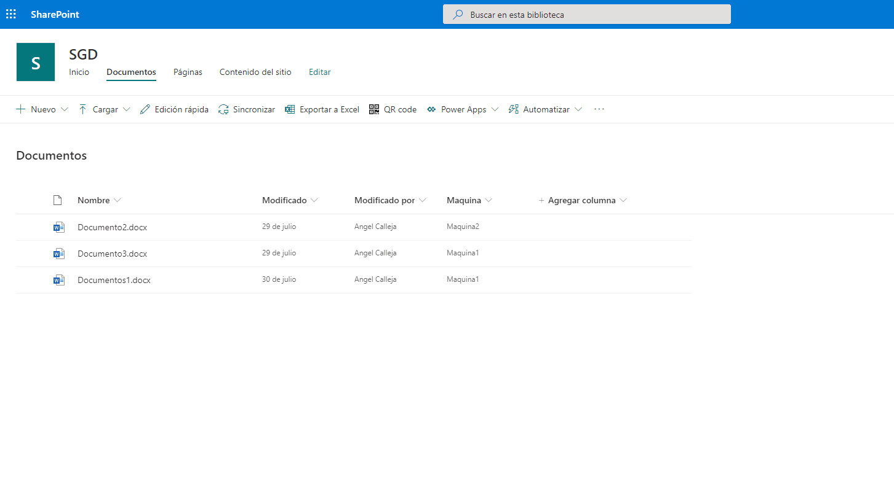

# Generate QR Code List Item Command View Set

## Summary

Generates a printable QR code which links to a SharePoint list item.

If no otem is selected, script capture list URL including metadat filters
Instead of printing lengthy SharePoint URLs that your users can't interact with, generate a QR code that will link them back to your SharePoint site.

## Applies to

* [SharePoint Framework](https://dev.office.com/sharepoint)
* [Office 365 tenant](https://dev.office.com/sharepoint/docs/spfx/set-up-your-development-environment)

## Minimal Path to Awesome

* Clone this repository
* in the command line run:
  * `npm install`
  * `gulp serve`

## Features

This extension will generate a QR code for a selected list item. If no list items are selected, the extension will generate a QR code for the library with metadata filters

This extension illustrates the following concepts:

* Specifying an SVG icon for the list item command view icon
* Customizing the SVG icon at run-time
* Generating a QR code for a selection
* Downloading an SVG image as a PNG file

## Original Solution

Solution|Author(s)
--------|---------
react-command-qrcode | Hugo Bernier ([Point Alliance](pointalliance.com), @bernierh)
spfx-extension-js-command-qrcode | [Siddharth Vaghasia](https://siddharthvaghasia.com/)

## Version history

Version|Date|Comments
-------|----|--------
1.0|September 1, 2019|Initial release
2.0|April 11, 2020|Filter metadata, translations
3.0|August 8, 2020|Callout to Dialog and discard Copy actions. Replace QRcanvas-react by QRCode (navigator direct copy)

## 2.0 Angel 11/04/2020
When no file is selected, it captures the applied filters (according to the metadata columns and incorporates them into the URL of the library).
Added languages (es-es, ca-es, pt-pt) for the buttons of the dialog window

## 3.0  Angel 08/08/2020
Callout replaced  by Dialog (simplify css).
Replace QRcanvas-react by QRCode (navigator direct copy). Now create an image (easy to copy) instead of canvas. It's simplify functions to download.